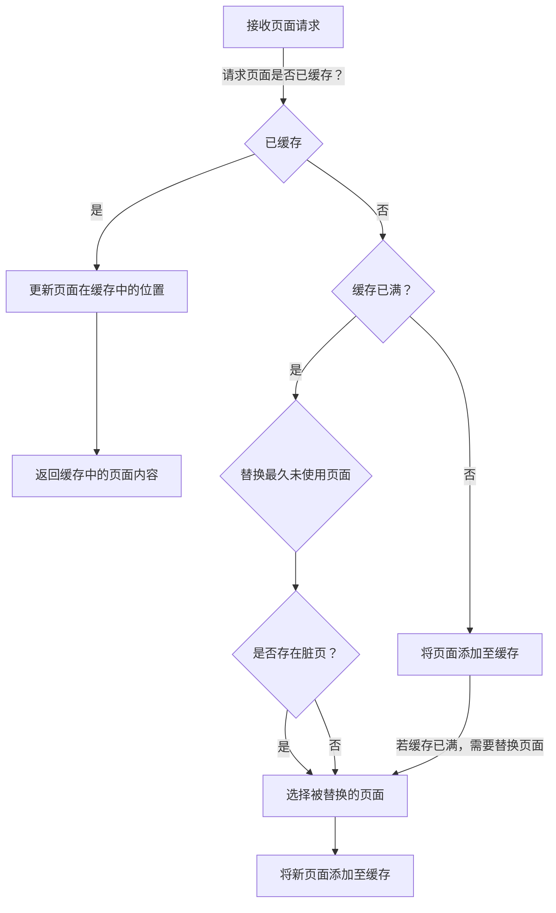

```html

/**
 *                             _ooOoo_
 *                            o8888888o
 *                            88" . "88
 *                            (| -_- |)
 *                            O\  =  /O
 *                         ____/`---'\____
 *                       .'  \\|     |//  `.
 *                      /  \\|||  :  |||//  \
 *                     /  _||||| -:- |||||-  \
 *                     |   | \\\  -  /// |   |
 *                     | \_|  ''\---/''  |   |
 *                     \  .-\__  `-`  ___/-. /
 *                   ___`. .'  /--.--\  `. . __
 *                ."" '<  `.___\_<|>_/___.'  >'"".
 *               | | :  `- \`.;`\ _ /`;.`/ - ` : | |
 *               \  \ `-.   \_ __\ /__ _/   .-` /  /
 *          ======`-.____`-.___\_____/___.-`____.-'======
 *                             `=---='
 *          ^^^^^^^^^^^^^^^^^^^^^^^^^^^^^^^^^^^^^^^^^^^^^
 *                     佛祖保佑        永无BUG
 *            佛曰:
 *                   写字楼里写字间，写字间里程序员；
 *                   程序人员写程序，又拿程序换酒钱。
 *                   酒醒只在网上坐，酒醉还来网下眠；
 *                   酒醉酒醒日复日，网上网下年复年。
 *                   但愿老死电脑间，不愿鞠躬老板前；
 *                   奔驰宝马贵者趣，公交自行程序员。
 *                   别人笑我忒疯癫，我笑自己命太贱；
 *                   不见满街漂亮妹，哪个归得程序员？
*/
```
```
  ░▒▓█▓▒░
 ░▒▓█▓▒░▒
░▒▒▓█▓▒░▒
▒▒▒▓█▓▒░▒
▒░░▓█▓▒░▒
▒░▒▓████
▒░▒▓█▓▓█
▒▒▒▓██▓▒
▒▒▒▓█▓▒░
▒▒░▓█▓▒░
 ▒░▒▓▒░ 
  ▒░▒
```